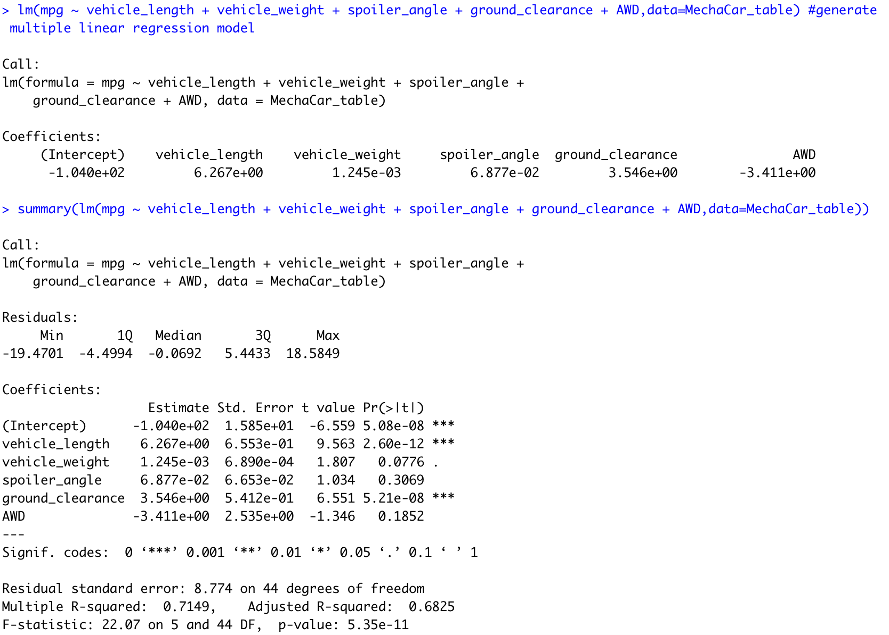

# MechaCar_Statistical_Analysis

## Linear Regression to Predict MPG

Above, we see the linear regression model and the summary statistics of our regression. We can see that the r-squared value is 0.7149, which means we have strong correlation between our independant and dependant variables. Our p-value is 5.35 e -11. We can also make the below conclusions from our analysis:

-Vehicle length and ground clearance provided non-random amounts of variance to the linear model. In other words the vehicle length and ground clearance have a significant impact on mpg.
-Our p-value is 5.35 e -11, which is much smaller than our assumed signififcane level of 0.05%.
Therefore, we can state that there is sufficient evidence to reject our null hypothesis, which means that the slope of our linear model is not zero.
-This linear model doesn't predict the mpg of the MechaCar prototypes effectively because the intercept is statistically significant. Our significant intercept could mean that the vehicle length and ground clearance may need transforming to help improve the predictive power of the model. It could also mean that there are other variables that aren't included in our model that could help explain the variability of our dependent variables better.

